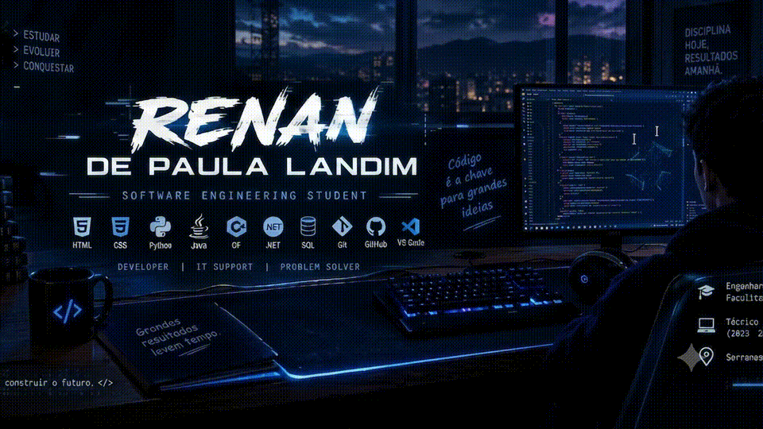

<div align="center">



</div>
<div align="center">

# 👨‍💻 Renan de Paula Landim

### Software Engineering Student • Developer • IT Support

</div>

---

---

<div align="center">

# 👨‍💻 Sobre Mim

### Software Engineering Student • Developer • IT Support

</div>

<table>
<tr>
<td width="65%">

Olá! Meu nome é **Renan de Paula Landim**.

Sou estudante de **Engenharia de Software na Faculdade Instituto Infnet**, atualmente no **2º semestre**, e formado em **Técnico em Informática (2023–2025)**.

Tenho contato com computadores desde os **7 anos** e experiência prática com **suporte técnico, manutenção, configuração de computadores e atendimento ao usuário**.

Também trabalhei durante **2 anos em Lan House**, experiência que me permitiu desenvolver conhecimentos em suporte, resolução de problemas e atendimento.

Atualmente, estou focado em evoluir na área de **desenvolvimento de software**, aprimorando meus conhecimentos através da faculdade, projetos pessoais e estudos.

</td>

<td width="35%" align="center">

💻 **Developer**

🛠️ **IT Support**

🎓 **Software Engineering**

🚀 **Always Learning**

<br>


</td>
</tr>
</table>

---

<div align="center">

## 🎓 Formação

</div>

<table align="center">
<tr>
<td align="center">

🎓

**Engenharia de Software**

Faculdade Instituto Infnet  
**Cursando — 2º semestre**

</td>

<td align="center">

💻

**Técnico em Informática**

**2023 — 2025**

</td>
</tr>
</table>

---

<div align="center">

## 🚀 Tecnologias & Conhecimentos

</div>

<div align="center">

### 💻 Desenvolvimento


<br><br>

### 🗄️ Ferramentas & Ambiente


</div>

<br>

| Área | Conhecimentos |
|---|---|
| 🌐 **Web** | HTML, CSS |
| 🐍 **Programação** | Python |
| ☕ **Desenvolvimento** | Java, C# |
| 🗄️ **Banco de Dados** | SQL |
| 🔧 **Versionamento** | Git, GitHub |
| 🖥️ **Suporte** | Manutenção, configuração e diagnóstico |
| 💻 **Sistemas** | Instalação e configuração de softwares |

---

<div align="center">

## 🛠️ Experiência com Tecnologia

</div>

Minha trajetória na tecnologia começou cedo, através do contato constante com computadores e da busca por aprender como eles funcionam.

Durante minha experiência em **Lan House**, tive contato direto com usuários e problemas do dia a dia, desenvolvendo conhecimentos em:

```text
🖥️ Manutenção e configuração de computadores
🔧 Diagnóstico e resolução de problemas
💿 Formatação e instalação de sistemas
📦 Configuração de softwares
👨‍💻 Suporte ao usuário
🌐 Desenvolvimento de sites e sistemas
